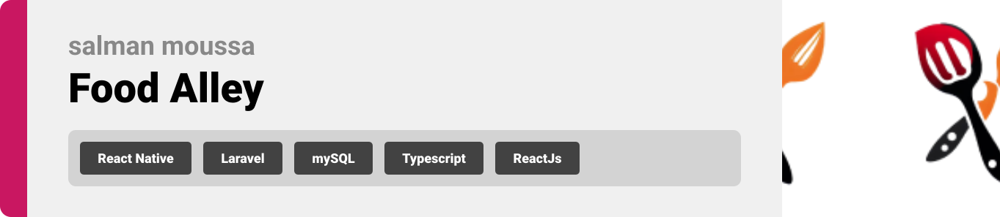
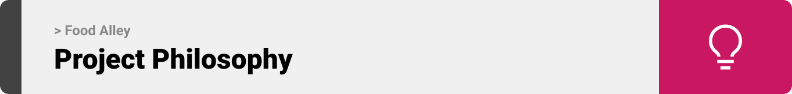
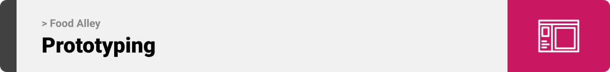

<br><br>

<!-- project philosophy -->


> A mobile app for Food based on your Mood.

### User Stories
- As a user , I want to be able to order food with specific ingredients and dietary restrictions so that I can easily find something to eat that  - fits my needs.
- As a user, I want to be able to filter out dishes with specific allergens so that I can avoid any potential health issues.
- As a user, I want to be able to browse through different sections for different types of cuisine so that I can discover new dishes and learn more about food culture around the world.
- As a user, I want to be able to customize my food order by selecting specific ingredients and the way I want it prepared so that I can get exactly what I'm in the mood for..
- As a user, I want to be able to play the mood test  game and get  the dish that fit my moode
- As a user, I want the app to offer a wide variety of customization options so that I can order food that tastes like it was made by my mom or grandma.
- As a admin, i want to be able to add food to the menu 
- As a admin, i want to be able to add kitchens

<br><br>

<!-- Prototyping -->


> We designed Coffee Express using wireframes and mockups, iterating on the design until we reached the ideal layout for easy navigation and a seamless user experience.

### Wireframes
| Login screen  | Register screen |  Landing screen |
| ---| ---| ---|
|  |  |  |

### Mockups
| Home screen  | Menu Screen | Order Screen |
| ---| ---| ---|
|  |  |  |

<br><br>

<!-- Implementation -->


> Using the wireframes and mockups as a guide, we implemented the Coffee Express app with the following features:

### User Screens (Mobile)
| Login screen  | Register screen | Landing screen | Loading screen |
| ---| ---| ---| ---|
|  |  |  |  |
| Home screen  | Menu Screen | Order Screen | Checkout Screen |
|  |  |  |  |

### Admin Screens (Web)
| Login screen  | Register screen |  Landing screen |
| ---| ---| ---|
|  |  |  |
| Home screen  | Menu Screen | Order Screen |
|  |  |  |

<br><br>

<!-- Tech stack -->


###  Food Alley is built using the following technologies:

- This project uses the React Native For the front-end .React-native is a cross-platform hybrid app development platform which allows us to use a single codebase for apps on mobile(Android, ios).
- this project uses ReactJs to creat the admin Website. ReactJS is a JavaScript library used for building user interfaces. It allows developers to create interactive and reusable UI components. ReactJS follows a component-based architecture, making it easier to manage and update different parts of an application independently. It efficiently renders and updates components, resulting in fast and responsive user experiences.
- this project uses Laravel to handle all the back-end of the app. Laravel is a PHP framework for web development, following MVC pattern. It offers efficient tools, a rich ecosystem, and promotes clean code for scalable applications.
  - this project uses MySQL for the Database mangment. MySQL is an open-source RDBMS for storing and managing structured data. It supports ACID transactions, multiple storage engines, and is widely used in web applications and CMS.
  - this project uses openai api to generate Mood Test question and to give suggested food based on the answer.

<br><br>

<!-- How to run -->


> To set up Food Alley locally, follow these steps:

### Prerequisites

This is an example of how to list things you need to use the software and how to install them.
* npm
  ```sh
  npm install npm@latest -g
  ```

### Installation

_Below is an example of how you can instruct your audience on installing and setting up your app. This template doesn't rely on any external dependencies or services._

1. Get a free API Key at [https://example.com](https://example.com)
2. Clone the repo
   ```sh
   git clone https://github.com/your_username_/Project-Name.git
   ```
3. Install NPM packages
   ```sh
   npm install
   ```
4. Enter your API in `config.js`
   ```js
   const API_KEY = 'ENTER YOUR API';
   ```

Now, you should be able to run Food-Alley locally and explore its features.
