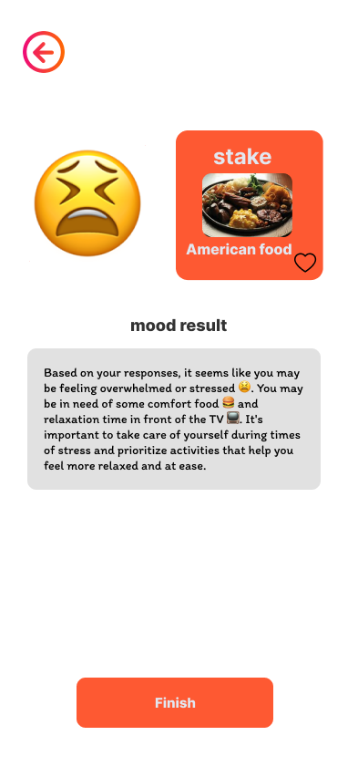
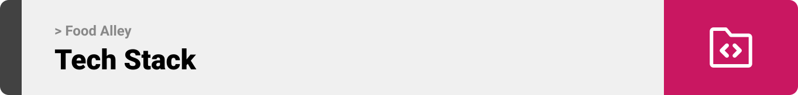

<br><br>

<!-- project philosophy -->


> A mobile app for Food based on your Mood.

### User Stories
- As a user , I want to be able to order food with specific ingredients and dietary restrictions so that I can easily find something to eat that  - fits my needs.
- As a user, I want to be able to filter out dishes with specific allergeies so that I can avoid any potential health issues.
- As a user, I want to be able to play the mood test  game and get  the dish that fit my moode
- ### Admin Stories
- As a admin, i want to be able to add food to the menu 
- As a admin, i want to be able to add kitchens

<br><br>

<!-- Prototyping -->


> We designed Food Alley using wireframes and mockups, iterating on the design until we reached the ideal layout for easy navigation and a seamless user experience.

### Wireframes
| Login screen  | Register screen | Mood Test |
| ---| ---| ---|
|  |  |  |

### Mockups
| kitchens menu   | Test Result |
| ---| ---| 
|  |  |

<br><br>

<!-- Implementation -->


> Using the wireframes and mockups as a guide, we implemented the Food Alley app with the following features:

### User Screens (Mobile)
| Login screen  | Register screen | Home screen | kitchens screen |
| ---| ---| ---| ---|
| .png) |  |  |  |
| Mood Landing  | Moodt test questions | Mood test result | Product Page |
|  | .png) | .png) |  |
 Product Page1 | kitchen page 
 |

### Admin Screens (Web)
| Login screen  | recipes |  kitchens |
| ---| ---| ---|
| .png) | .png) | .png) |
| Add recipe  | Add Kitchens | 
| .png) | .png) |

<br><br>

<!-- Tech stack -->


###  Food Alley is built using the following technologies:

- This project uses the React Native For the front-end .React-native is a cross-platform hybrid app development platform which allows us to use a single codebase for apps on mobile(Android, ios).
- this project uses ReactJs to creat the admin Website. ReactJS is a JavaScript library used for building user interfaces. It allows developers to create interactive and reusable UI components. ReactJS follows a component-based architecture, making it easier to manage and update different parts of an application independently. It efficiently renders and updates components, resulting in fast and responsive user experiences.
- this project uses Laravel to handle all the back-end of the app. Laravel is a PHP framework for web development, following MVC pattern. It offers efficient tools, a rich ecosystem, and promotes clean code for scalable applications.
  - this project uses MySQL for the Database mangment. MySQL is an open-source RDBMS for storing and managing structured data. It supports ACID transactions, multiple storage engines, and is widely used in web applications and CMS.
  - this project uses openai api to generate Mood Test question and to give suggested food based on the answer.

<br><br>

<!-- How to run -->


> To set up Food Alley locally, follow these steps:

### Prerequisites

This is an example of how to list things you need to use the software and how to install them.

- npm
  ```sh
  npm install npm@latest -g
  ```

### Installation

To install FoodAlley locally:

1. Open any terminal (like command prompt or vs terminal) and navigate to where you want to install the project (run cd folder-name)
2. Clone the repo
   ```sh
   git clone https://github.com/salman-moussa/Food-alley
   ```
3. Navigate to the desktop app folder and install NPM packages
   ```sh
   npm install
   ```
4. Run the desktop app
   npm start
5. Make sure you have Laravel installed on your computer by visiting the official website

6. Navigate to the mobile app folder and install NPM packages
   npm install
7. Install expo
   npm install -g expo-cli
8. Run the mobile app
   expo start
9. Run it on the web
   press w

Now, you should be able to run GoResto (desktop app and mobile app) locally and explore its features.
